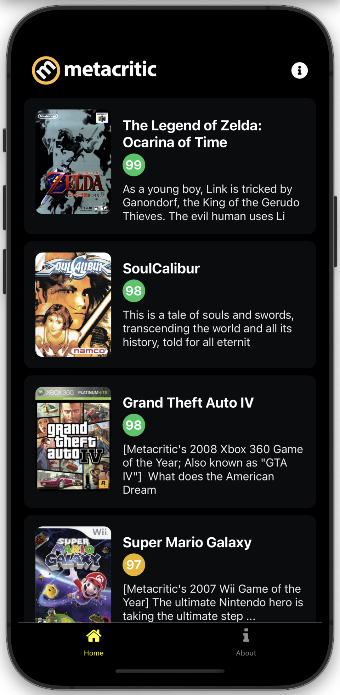
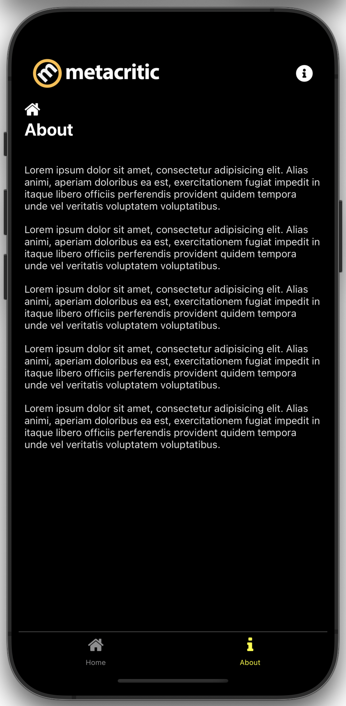

# Midudev's React Native (Expo) 2024 Course Code
<div style="display: flex; justify-content: space-evenly;">
  
  
  
</div>

## Topics covered 
<div style="display: flex; justify-content: space-around; font-size: medium">
  <ul>
    <li>What is React Native?</li>
    <li style="margin-left: 12px;">Advantages and disadvantages</li>
    <li style="margin-left: 12px;">Why you should learn it?</li>
    <li>What is Expo?</li>
    <li style="margin-left: 12px;">Advantages and disadvantages</li>
    <li>Create a project with Expo</li>
    <li style="margin-left: 12px;">Folder structure review</li>
    <li>Initial React Native components</li>
    <li style="margin-left: 12px;">View</li>
    <li style="margin-left: 12px;">Text</li>
    <li style="margin-left: 12px;">Button</li>
    <li style="margin-left: 12px;">StatusBar: Expo component</li>
    <li style="margin-left: 12px;">Image</li>
    <li style="margin-left: 12px;">ActivityIndicator</li>
    <li style="margin-left: 12px;">FlatList</li>
    <li style="margin-left: 12px;">ScrollView</li>
    <li style="margin-left: 12px;">SafeAreaView</li>
  </ul>
  <ul>
    <li>Data fetching</li>
    <li>Loading SVG images</li>
    <li>Animations</li>
    <li>Tailwind in React Native</li>
    <li>Pull to refresh</li>
    <li>Tailwind installation and configuration</li>
    <li>Improving the UI of the App</li>
    <li>Routing</li>
    <li>Creating App's first Screen</li>
    <li>Customizing a button with Pressable</li>
  </ul>
  <ul>
    <li>Dynamic routes</li>
    <li>useLocalSearchParams</li>
    <li>Navigation with "animation"</li>
    <li>Fixing App's color and Header</li>
    <li>ScreenLayout</li>
    <li>Changing the header at page level</li>
    <li>Grabbing game's information</li>
    <li>CORS trick</li>
    <li>Tabs</li>
    <li>Customizing Tabs</li>
  </ul>
</div>

## Course Videos (YouTube)
<div style="display: flex; justify-content: space-evenly;">
  <a href="https://www.youtube.com/watch?v=U23lNFm_J70" target="_blank">
    
  </a>
  <a href="https://www.youtube.com/watch?v=ZDoiMLqWz2E" target="_blank">
    
  </a>
</div>

## Create project with template files
```shell
npx create-expo-app@latest example-curso-react-native
```
## Create project without template files
```shell
npx create-expo-app@latest curso-react-native-metacritic-app --template blank
```
## Activate "open web"
```shell
npx expo install react-dom react-native-web @expo/metro-runtime
```
## Run / Execute project
```shell
npm start
```
## Expo Constants
```shell
npx expo install expo-constants
```
## React Native Safe Area Context
```shell
npx expo install react-native-safe-area-context
```
## SVG in React Native
```shell
npx expo install react-native-svg
```
https://react-svgr.com/playground/
## Tailwind (Nativewind) in React Native
```shell
npm install nativewind@2
npm install --save-dev --save-exact tailwindcss@3.3.2
npx tailwindcss init
```
## React Native Routing
```shell
npx expo install expo-router react-native-safe-area-context react-native-screens expo-linking expo-constants expo-status-bar
```
## Expo Vector Icons
https://icons.expo.fyi
```shell
npm install @expo/vector-icons
```